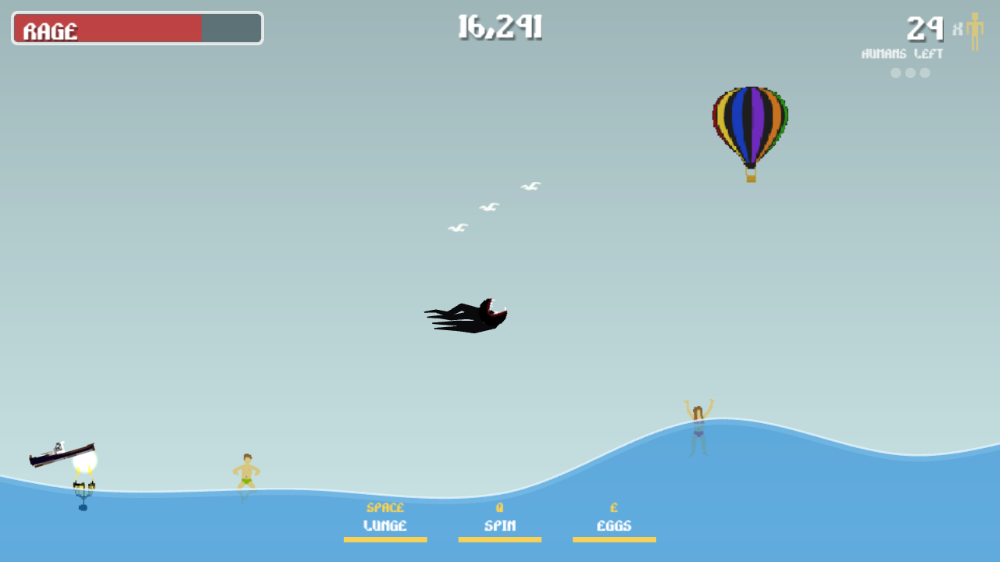

# Super Mega Squid: Terror of the Deep

A physics-driven arcade rampage for the browser. You are a very angry squid. Leap out of the sea, lunge through
seagulls and hot-air balloons, whip boats apart with your tentacles and eat every last human in town before your
rage runs out.



I built the first version of this game in 2013 with HaxeFlixel for the [One Game A Month](http://www.onegameamonth.com)
challenge, but it was never finished. This repository now holds a complete rewrite for the modern web, with the original
art, sound and music.

## How to play

**Goal:** eat all 35 humans (swimmers, divers, ferry passengers and balloonists) before your **rage** meter empties.
Rage drains constantly, a little faster the longer the rampage lasts, and refills whenever you eat something.

Pick one of seven levels when you start:

- **The Cove**: the original map, with cliffs at both ends and a floating isle over open water.
- **Arch Rock**: a floating stone arch whose legs dip into the sea, a broken sea stack you can dive under, stepping
  stones up to a sky island, a deep trench and a planted reef.
- **Sky Isles**: tiers of floating isles to climb, up to a great wooded isle high above the sea.
- **The Grotto**: a vast cave roof over the sea, hung with vines and columns, with gaps to leap up through to its top.
- **Needle Rocks**: a forest of tall, broken sea stacks with mossy ledges and crowns; some hang over their stumps.
- **Coral Shallows**: a raised reef thick with weed and coral, a table reef to hide under, a blue hole and wooded cays.
- **Fire Isle**: a volcano with a lava lake in its crater, its hot roots hanging over glowing vents on the seabed.

High scores are kept for each level.

You only hurt things you hit **fast**: swim hard, lunge or spin your tentacles. Slow bumps just push prey around.
Kills made out of the water can drop time into slow motion, as in the original: always for a wreck (a boat, a
balloon, an aircraft) or a human, and one time in three for anything else.

| Action     | Keyboard           | Gamepad             | Touch                  |
| ---------- | ------------------ | ------------------- | ---------------------- |
| Swim/steer | WASD or arrow keys | Left stick / D-pad  | Drag on the left half  |
| Lunge      | Space (or J, Z)    | A / right trigger   | LUNGE button           |
| Spin       | Q (or K, X)        | B, X / right bumper | SPIN button            |
| Egg bombs  | E (or L, C)        | Y / left bumper     | EGGS button            |
| Pause      | Esc or P           | Start               | Pause button           |
| Music      | M                  |                     | Pause menu             |
| Fullscreen | F                  |                     | Menu, pause menu       |

- **Underwater** you swim freely and can lunge every half second.
- **In the air** you can only steer sideways and dive, and you get **one lunge** until you touch water or land on rock.
  That makes a double lunge: lunge upwards just below the surface to leap out, then lunge again at the top of the leap
  to reach birds, balloons and aircraft.
- **Spin** whips your tentacles around, briefly stops your fall and **parries** bullets and torpedoes. Your tentacles
  only hurt things while they are being swung, in a spin or right after a lunge.
- **Egg bombs** drop a volley of six eggs that float up through the water and destroy whatever they touch.
- Eating in quick succession builds a **combo** multiplier for your score.

The more humans you eat, the more the town fights back: the coast guard sends helicopters that shoot at you whenever
you are above water, then the navy deploys submarines with homing torpedoes. Electric eels shock and stun you while
they are sparking, so eat them when they are calm. Ferries take three hits to sink and passengers tumble out.

## Running it

Requires Node.js 22.12 or newer (24 recommended).

```sh
npm install
npm run dev        # start a dev server at http://localhost:5173
npm run build      # typecheck and build a static site into dist/
npm run preview    # serve the production build
```

The build is a static site with relative paths, so `dist/` can be hosted anywhere. The included
`.github/workflows/deploy.yml` publishes it to GitHub Pages on every push to `main`; enable it once under
**Settings → Pages → Source: GitHub Actions**.

### Tests

```sh
npm test           # unit tests and headless gameplay simulation tests (Vitest)
npm run test:e2e   # end-to-end tests that play the built game in Chromium (Playwright)
```

The end-to-end tests run Chromium with software WebGL, so they work without a GPU. Install a browser once with
`npx playwright install chromium`, or point `PLAYWRIGHT_CHROMIUM_EXECUTABLE` at an existing Chrome/Chromium.

## How it is built

| Concern   | Then (2013)                      | Now                                                  |
| --------- | -------------------------------- | ---------------------------------------------------- |
| Language  | Haxe 2                           | TypeScript                                           |
| Engine    | HaxeFlixel on NME                | [Phaser 4](https://phaser.io) (WebGL)                |
| Physics   | Nape                             | [Planck.js](https://piqnt.com/planck.js/) (Box2D)    |
| Tooling   | FlashDevelop / NME command line  | [Vite](https://vite.dev), Vitest, Playwright         |
| Targets   | Flash, desktop, Android          | Any modern browser: desktop, phones and tablets      |

```
src/
  sim/        Headless game simulation: physics, water, squid, enemies, spawning, rules (no Phaser)
  scenes/     Phaser scenes: Boot (loading), Menu, Levels (level select), Game, Hud (HUD, touch controls, pause), Results
  render/     Views that draw the simulation: backdrop, water, squid, entities, effects
  level/      Level list (names, spawn points, buoys) and the generated level data
  config.ts   Every tuning value: physics, abilities, enemies, spawn rates, scoring
  input.ts    Keyboard, gamepad and touch merged into one input per physics step
  audio.ts    Music, ambience and sound effects
scripts/      Asset pipeline (level tiles, collision outlines, audio transcoding) and the level art generator
art/          Source art and audio the pipeline builds from (not shipped)
public/       Game-ready assets served as-is
tests/        unit/ (Vitest) and e2e/ (Playwright)
```

The simulation runs at a fixed 60 Hz, independent of the display's refresh rate, and the renderer interpolates between
steps. Because it has no rendering dependencies, gameplay can be tested headlessly: the Vitest suite drives the real
squid through leaps, kills, parries, eel shocks and full games.

Water is a translucent layer over everything below the surface, as in the original. Its surface combines the original
slow swell with a spring-based ripple simulation, and bodies float using real submerged area and centroid, so boats
right themselves and swimmers bob head-up.

### Asset pipeline

Each level's art is a single image about 9000×3000 pixels, too large for many GPUs, in `art/levels/<id>/`.
`npm run assets:level` composites the vegetation layer over the terrain, slices the result into 1024 px tiles (skipping
empty ones), extracts collision outlines from the terrain's alpha channel with marching squares, renders a preview for
the level select screen, and writes `src/level/<id>.json`. `npm run assets:audio` transcodes the original WAV files to
Ogg Vorbis and MP3 (needs `ffmpeg`). The outputs are committed, so you only need these after changing files in `art/`.
The game loads only the previews up front; a level's tiles load when you start it (with a progress bar), and the
previous level's are freed.

The Cove is the original 2013 art. The other levels are drawn by `npm run assets:generate` in the same style. Each
level's layout is in `scripts/levels/<id>.ts`: hand-shaped rock outlines (plus helpers for floating islands, sea stacks,
stumps and the seabed in `scripts/levels/common.ts`) and which decorations each rock gets. `scripts/lib/rock-art.ts`
paints them like the original: craggy stones with outlines, bevels, light rims and spots; dark mortar with strata and
shards (under the tops of the floating islands, as in the original); orange cracks and lava pools; thick moss caps with
light blobs and flame-shaped drips; hanging grass under overhangs; vines that crawl over the rock and hang from it; and
sand. Its seaweed, coral, shells and trees are cut out of the original art and replanted. Anything thin or hanging goes
in the decoration layer, so it never becomes collision. In 2D, rock that stands on the seabed and rises through the
surface would cut the sea in two, so rocks that pierce the surface float, with room to swim beneath (a test checks
every level for sealed-off water). The generator is deterministic; after changing it, run `npm run assets:generate`
(optionally with level ids) and then `npm run assets:level`.

## What changed from the 2013 version

The original stopped at a "February preview edition": you could swim around and eat things, but rage emptying did
nothing, there was no score, no goal and no ending. This version finishes the design:

- **A goal and an ending**: rage is your life, the town has 35 humans to eat, and there are victory and game-over screens
  with a score breakdown and saved high scores.
- **Six new levels** in the style of the original, chosen from a level select screen.
- **Escalation**: alert levels bring helicopter gunfire, submarine torpedoes and more military traffic.
- **More to do**: combos and score, spin parries, a three-hit ferry with passengers, balloonists who fall into the sea,
  cargo planes that drop crates, swimmers and divers who flee, moored buoys, bubbles, splashes and ripples.
- **Slow motion you notice**: the original slowed time on one airborne kill in seven, briefly, with no other cue. Here
  wrecks and humans snatched mid-leap always slow it, it holds for a moment, the camera pushes in and sounds drop in
  pitch.
- **Modern controls and presentation**: gamepad support, a floating touch joystick, a layout that adapts to any screen
  shape (landscape, portrait or anything between), a pause menu, music and sound toggles, and the wind/underwater
  ambience the original prepared but never played.

Bugs fixed along the way:

- Recycled enemies kept their old direction because spawning only ever set it to "left".
- The female swimmer sprite was cut with the wrong frame size, garbling her animation.
- Motor boats sailed backwards (their art faces left).
- Electric eels had the fish collision type, so their handler never ran and their sparks were harmless.
- The humans counter started at 100, then switched to showing humans eaten.
- Rage could overflow its bar, and reaching zero did nothing.
- The mouth-opening sensor looked 0 to 1 radian to one side instead of ±0.5 radians ahead.
- Lunge could be spammed underwater, and spin and egg bombs had no cooldowns.
- Egg bombs collided with the squid that laid them.
- Enemies could spawn outside the edges of the map.
- All timing was per frame, so the game would have run too fast on high refresh rate screens.
- The level collision was rebuilt from the bitmap on every launch, making loading slow.

## Credits

- Original game (2013): Rory Bourdon / Pause 9. All art, sound effects and music come from the original build.
- Font: *Rocket Propelled* by Digital Graphic Labs
- Built with Phaser, Planck.js and Vite

Videos of the original 2013 build:

https://user-images.githubusercontent.com/3112707/142712498-ab4eee7e-eb30-4a16-8361-2726eb64bf20.mp4

https://user-images.githubusercontent.com/3112707/142712502-6f6c5891-6c85-45d6-bc84-ddf8d11f503c.mp4

https://user-images.githubusercontent.com/3112707/142712506-ed2ba6d2-dc03-478a-acad-cc65165f21eb.mp4

## License

[MIT](LICENSE)
